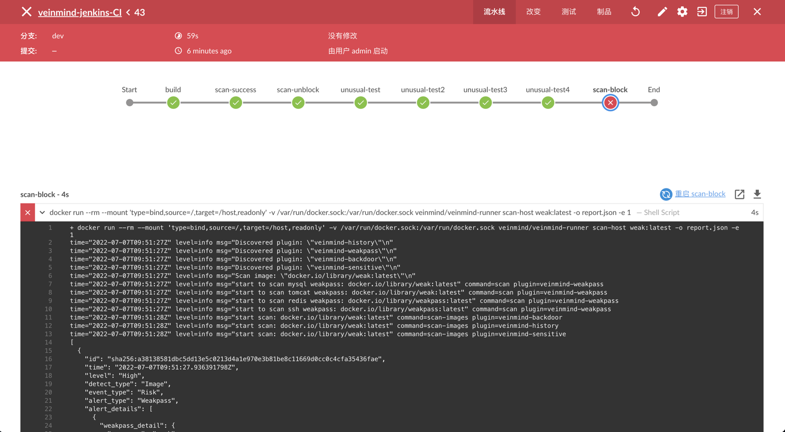
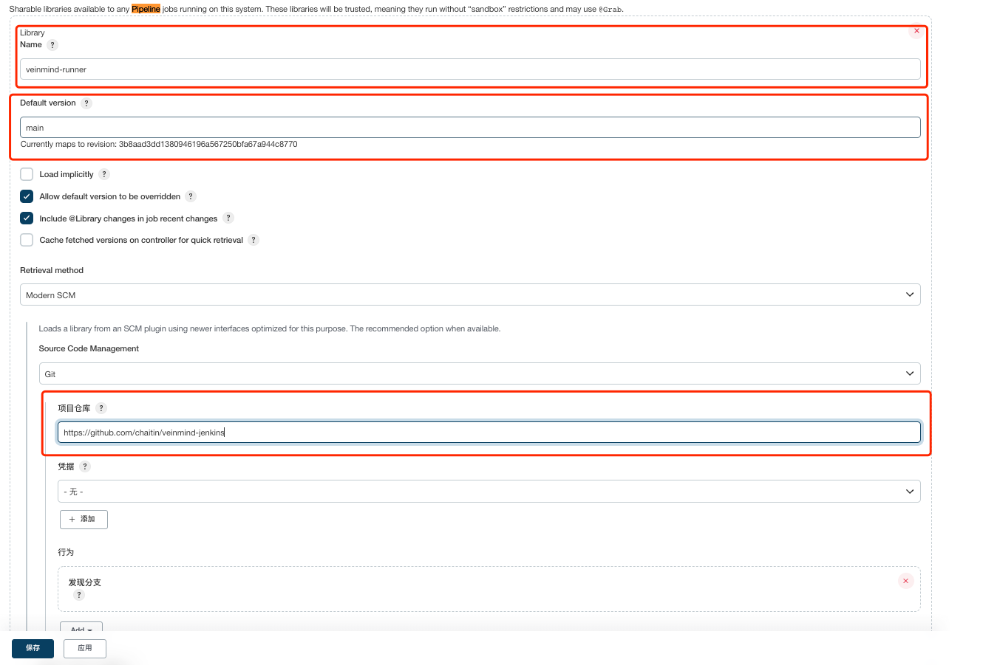

# Veinmind Jenkins

> [veinmind-tools]() 集成进 Jenkins 



## 🕹️ 快速开始

扫描在 Job 过程中构建的镜像
> 注意：所有的使用方式都是默认Jenkins安装了以下插件
> + Docker plugin
> + Pipeline: Groovy Libraries

**1. 通过Pipeline Libraries引入配置**

在 Manage Jenkins » Configure System » Global Pipeline Libraries 添加

`https://github.com/chaitin/veinmind-jenkins`



随后即可在Jenkinsfile内使用:

```groovy
// import library
@Library('veinmind-runner') _

pipeline {
  agent any

  stages {
    stage('build') {
        steps {
            script {
                sh 'docker build -t YOUR_IMAGE:YOUR_TAG  .'
            }
        }
    }

    // add scan
    stage('scan') {
        steps {
            script {
                // easy mod
                veinmindRunner.scan("YOUR_IMAGE:YOUR_TAG")
                
                // set exit-code
                veinmindRunner.scan("YOUR_IMAGE:YOUR_TAG", 1)
                
                // set output
                veinmindRunner.scan("YOUR_IMAGE:YOUR_TAG", outPut="report.json", exitCode=0)
                
                // set all config params
                veinmindRunner.scan("YOUR_IMAGE:YOUR_TAG", "scan-host", "report.json", 0)
            }
        }
    }
  }
}
```

## 🏳️‍🌈 参数设置

| 参数名称    | 参数作用                          | 默认值         |
| ---------- |-------------------------------|-------------|
| imageRef  | 镜像 Reference                  |             |
| scanAction | 扫描功能类型                        | scan-host   |
| outPut    | 报告输出名称                        | report.json |
| exitCode  | 当发现安全问题时的程序退出码, 非零时阻断Pipeline | 0           |
