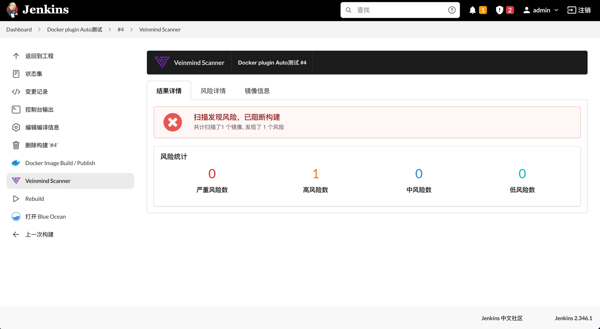
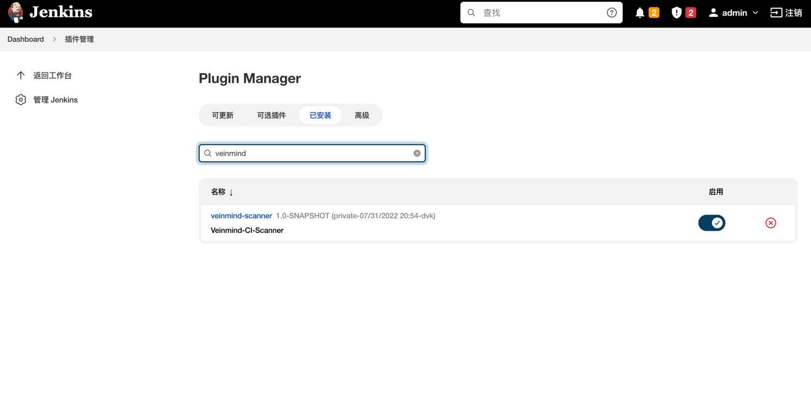
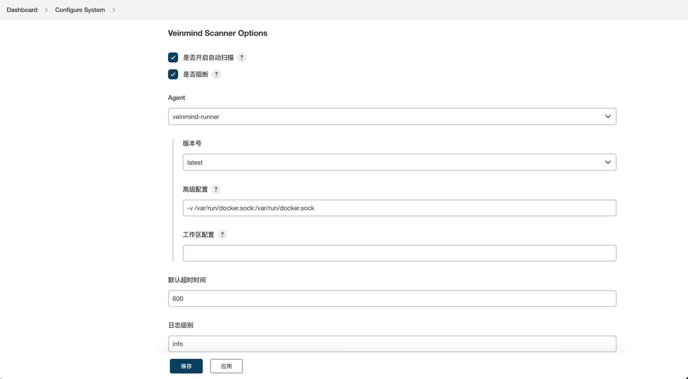
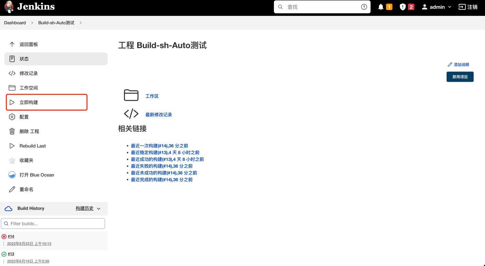
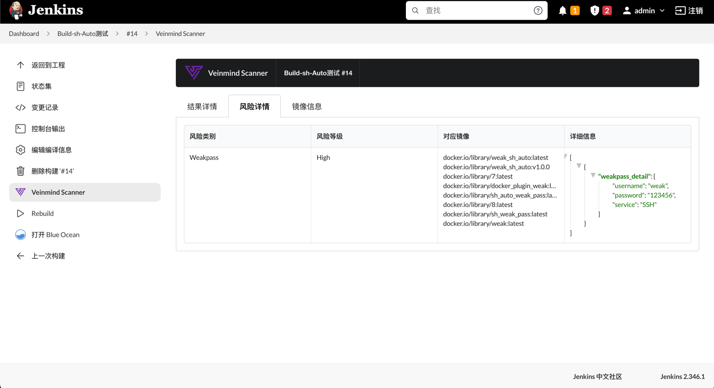
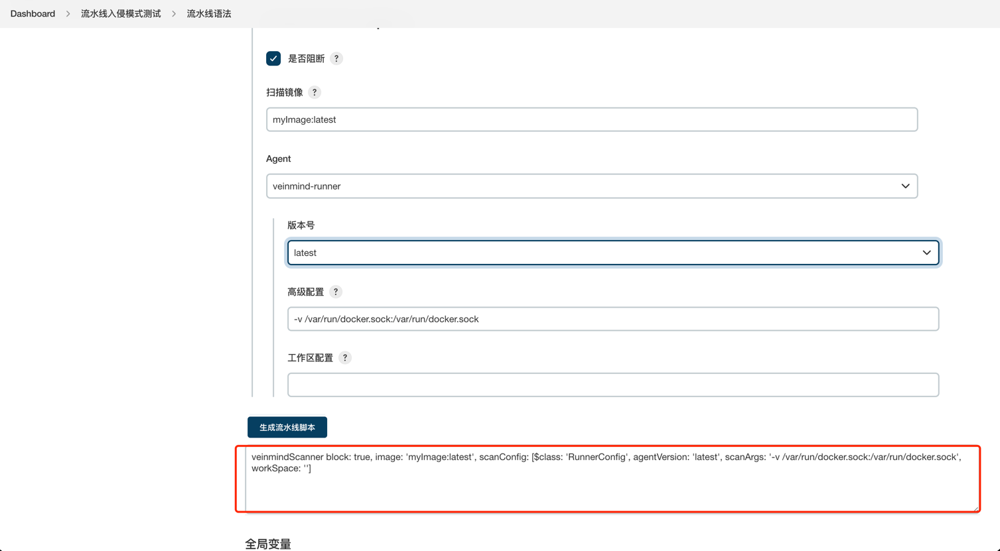
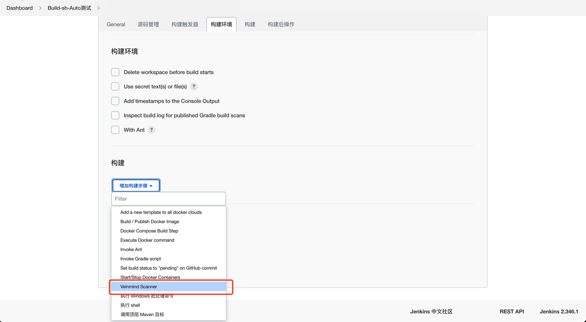
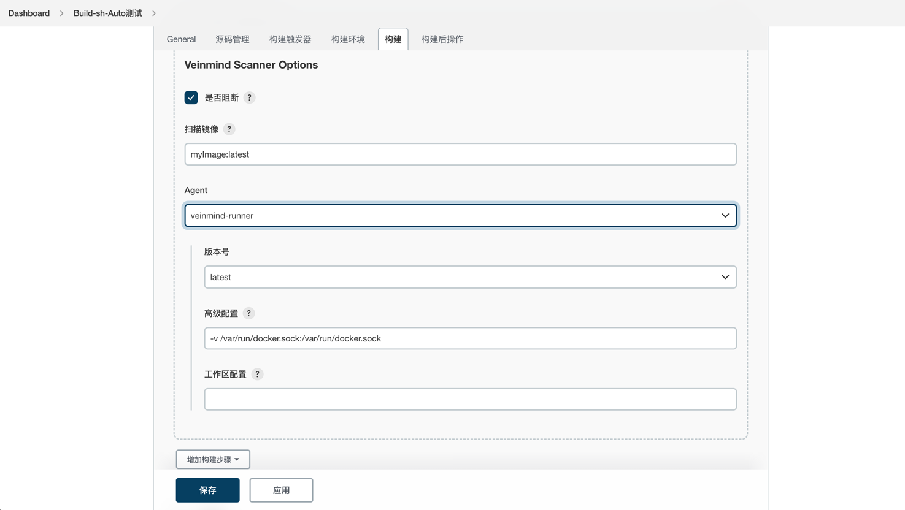

# Veinmind Jenkins

> [veinmind-tools]() 集成 Jenkins

欢迎使用 Veinmind Jenkins 安全插件，使用该插件，您可以快速集成 `veinmind-runner` 扫描能力到您的CI中。


# 🕹️ 快速开始

Veinmind Jenkins 支持如下两种方式使用

## ✨ 方式1: 使用 Veinmind Scanner 插件 (推荐)

+ 支持自动扫描模式，**无需修改Jenkinsfile文件或BuildStep**，自动识别`docker build`的动作，触发扫描任务。
+ 支持手动模式，可以手动增加Build Step/Pipeline Step来手动触发扫描。
+ 简便安装，一次安装，永久使用。
+ 使用简单，无需记住复杂的参数，鼠标配置即可。
+ 支持阻断功能。
+ 提供数据统计和详情页面。



### 适配性

Veinmind Scanner 需要如下的条件。

1. Jenkins 支持版本 > v2.332.4

2. 对于自动扫描功能，目前支持的自动扫描的方法:

| 插件名称                                                               | Job类型    | 是否支持Auto |
|--------------------------------------------------------------------|----------|:--------:|
| Linux Shell                                                        | FreeStyle |    ✅     |
| [Docker plugin](https://plugins.jenkins.io/docker-plugin/)         | FreeStyle |    ✅     |
| [Docker build step](https://plugins.jenkins.io/docker-build-step/) | FreeStyle |    ✅     |
| Pipeline Shell(sh)                                                 | Pipeline |    ✅     |
| [Docker Pipeline](https://plugins.jenkins.io/docker-workflow/)     | Pipeline |   ✅      |

### 使用步骤

1. 将插件安装至 Jenkins 并重新启动。



2. 在 `Manage Jenkins` -> `Configure System` 勾选自动扫描选项, 配置好全局变量并保存。



3. 立即构建一个存在镜像build的Job。



5. 等待扫描结束，即可在侧边栏查看到扫描结果。




### 进阶使用

1. 使用 `veinmindScanner` 来在 Jenkinsfile 内手动插入扫描步骤。


`veinmindScanner block: true, image: 'YOOUR_IMAGE_REF', scanConfig: [$class: 'RunnerConfig', agentVersion: 'latest', scanArgs: '-v /var/run/docker.sock:/var/run/docker.sock', workSpace: '']`

如果不熟悉Pipeline语法，可以在 `pipeline-syntax` 流水线语法处，选择veinmindScanner，根据配置项生成对应的Pipeline语句。



2. 手动增添build-step。





### 参数设置

配置参数分为全局配置和job配置。

自动扫描默认使用的是全局配置，因此如果您想要使用自动扫描功能，请先配置Global Config。

对于全局配置和job配置都存在的参数，优先使用job配置的参数。

| 参数名称        | 参数作用                                                                                                                               | 默认值                                          |
|-------------|------------------------------------------------------------------------------------------------------------------------------------|----------------------------------------------|
| 是否开启自动(全局)  | 自动扫描开关                                                                                                                             | false                                        |
| 日志等级(全局)    | 在控制台输出的日志级别                                                                                                                        | info                                         |
| 超时时间(全局)    | 扫描异常的超时时间                                                                                                                          |  600                                         |
| 是否阻断        | 当发现风险时是否阻断流程                                                                                                                       | false                                        |
| Agent       | 使用扫描的探针                                                                                                                            | veinmind-runner                              |
| 版本号         | 使用探针的版本号，需要能够访问github，若无法访问则默认使用latest版本                                                                                           | latest                                       |
| 高级配置        | 扫描参数的高级配置，默认无需修改                                                                                                                   | -v /var/run/docker.sock:/var/run/docker.sock |
| 工作区配置       | 如果您的Jenkins是使用容器部署的，并且配置了jenkins工作目录的挂载 (如: -v /home/jenkins_home:/var/jenkins_home) 请填写您挂在的实际路径。(在上述例子中，此处应该填写/home/jenkins_home) | ""                                           |


## ✈️ 方式2: 使用 Veinmind Jenkins Lib (不推荐)

### 适配性

> 注意：所有的使用方式都是默认Jenkins安装了以下插件
> + Docker plugin
> + Pipeline: Groovy Libraries

### 使用步骤

**1. 通过Pipeline Libraries引入配置**

在 Manage Jenkins » Configure System » Global Pipeline Libraries 添加

`https://github.com/chaitin/veinmind-jenkins`


随后即可在Jenkinsfile内使用:

```groovy
// import library
@Library('veinmind-runner') _

pipeline {
  agent any

  stages {
    stage('build') {
        steps {
            script {
                sh 'docker build -t YOUR_IMAGE:YOUR_TAG  .'
            }
        }
    }

    // add scan
    stage('scan') {
        steps {
            script {
                // easy mod
                veinmindRunner.scan("YOUR_IMAGE:YOUR_TAG")
                
                // set exit-code
                veinmindRunner.scan("YOUR_IMAGE:YOUR_TAG", 1)
                
                // set output
                veinmindRunner.scan("YOUR_IMAGE:YOUR_TAG", outPut="report.json", exitCode=0)
                
                // set all config params
                veinmindRunner.scan("YOUR_IMAGE:YOUR_TAG", "scan-host", "report.json", 0)
            }
        }
    }
  }
}
```

### 参数设置

| 参数名称    | 参数作用                          | 默认值         |
| ---------- |-------------------------------|-------------|
| imageRef  | 镜像 Reference                  |             |
| scanAction | 扫描功能类型                        | scan-host   |
| outPut    | 报告输出名称                        | report.json |
| exitCode  | 当发现安全问题时的程序退出码, 非零时阻断Pipeline | 0           |
